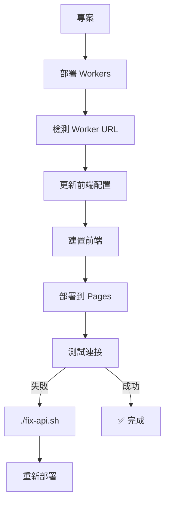

# 🔧 API 連接問題解決指南

## 🚨 **問題症狀**
- 前端部署到 Cloudflare Pages 後無法呼叫 API
- 瀏覽器控制台出現 CORS 或網路錯誤
- 聊天功能無法正常運作

## 💡 **解決方案**

### 🎯 **一鍵修復（推薦）**

```bash
# 智能修復 API 連接問題
./fix-api.sh
```

這個腳本會：
- ✅ 自動檢測您的 Worker URL
- ✅ 更新前端配置文件
- ✅ 測試 API 連接
- ✅ 重新建置前端

### 🔄 **完整重新部署**

```bash
# 如果修復腳本無法解決問題
./auto-deploy.sh
```

### 🛠️ **手動修復**

1. **檢查 Worker URL**
   ```bash
   cd workers
   wrangler deployments list --name ai-chat-api-router
   ```

2. **編輯前端配置**
   編輯 `frontend/env.config.js`：
   ```javascript
   const config = {
     development: {
       apiBaseUrl: 'http://localhost:8787'
     },
     production: {
       apiBaseUrl: 'https://ai-chat-api-router.您的帳號.workers.dev'
     }
   }
   ```

3. **重新建置和部署**
   ```bash
   cd frontend
   npm run build
   wrangler pages deploy dist --project-name=cloudflare-ai-chat-demo
   ```

## 🔍 **常見原因**

| 問題 | 解決方法 |
|------|----------|
| Worker URL 不正確 | 執行 `./fix-api.sh` |
| CORS 錯誤 | Workers 已內建 CORS，檢查 URL 配置 |
| API Secrets 未設定 | 在 Cloudflare Dashboard 設定 |
| 網路超時 | 檢查 Worker 運行狀態 |

## 🚀 **部署流程總覽**



## 📞 **需要協助？**

如果問題仍然存在：
1. 檢查 [Cloudflare Dashboard](https://dash.cloudflare.com) 中的 Worker 狀態
2. 確認 API Secrets 已正確設定
3. 查看瀏覽器開發者工具的錯誤訊息
4. 參考 [DEPLOYMENT.md](./DEPLOYMENT.md) 完整指南 